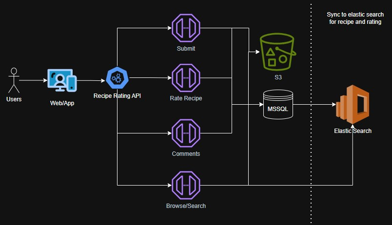

# Recipe Rating Api - Design Document

## Summary
- All POST operations such as creating a new recipe, submitting a rating, or adding a comment will be stored in MSSQL for relational data integrity.
- New recipes are currently stored without associating them with a user ID.
- New recipes and ratings are also indexed in elastic search to support full-text, fuzzy and filtered search capabilities.
- The ratings endpoint retrieves the previous recipe rating (if any) and recalculates the recipe's average rating accordingly. Individual user ratings are currently not factored in, as the focus is on maintaining an average rating for the recipe.
- The comment endpoint stores the user id to associate each comment with its recipe, allowing the application to display who posted the comment on the recipe.

---

## Architecture Diagram

---

## API Endpoints

### Endpoints
| Method | Endpoint                          | Description                             |
|--------|-----------------------------------|-----------------------------------------|
| POST   | `/api/recipes`                    | Submit a new recipe                     |
| GET    | `/api/recipes?search={keyword}`   | search recipes                          |
| GET    | `/api/recipes/{id}`               | Get recipe details                      |
| POST   | `/api/recipes/{id}/ratings`       | Submit a rating (1–5 stars)             |
| POST   | `/api/recipes/{id}/comments`      | Add a comment to a recipe               |
| GET    | `/api/recipes/{id}/comments`      | Get all comments for a recipe           |

### Sample Request and Response
#### Submit Recipe
curl --location '/api/recipes' \
--header 'api-key: {key}' \
--form 'file=@"{path-to-image}/chicken.jpg"' \
--data '{
            "title": "Crispy Fried Chicken",
            "ingredients": ["Chicken", "Buttermilk", "Flour", "Seasoning", "Oil"],
            "instructions": "Mix flour and buttermilk together, including seasoning, then fry it with oil"
        }'

Response
{
  "id": 1,
  "message": "Recipe created successfully"
}

curl --location '/api/recipes?search=chicken' \
--header 'api-key: {key}'

Response
[
  {
    "id": 1,
    "title": "Crispy Fried Chicken",
    "ingredients": ["Chicken", "Buttermilk", "Flour", "Seasoning", "Oil"],
    "instructions": "Mix flour and buttermilk together, including seasoning, then fry it with oil"
    "averageRating": 4.5,
    "imageUrl": "https://example.com/chicken.jpg"
  }
]

curl --location '/api/recipes/1/ratings' \
--header 'api-key: {key}'
--data  '{
            "rating": 5
         }'

Response
{
    "averageRating": 5,
    "message": "Rating submitted"
}

---

## Technology Stack
### Framework
.NET 8
- High-performance and optimized runtime.
- Cross-platform support (Windows, Linux, macOS).
- Built-in containerization optimizations for cloud-native apps.

### ORM
Entity Framework Core
- Modern, cross-platform ORM for .NET.
- Supports LINQ, migrations, and efficient database access.

### Database
MSSQL Database
- Seamless integration with .NET and Entity Framework Core.
- Enterprise-grade security, tooling, and monitoring.
- Highly scalable and reliable for production workload.

### Containerization
Docker
- Industry-standard container platform for packaging and deploying applications.
- Enables consistent environments across development, testing, and production.

### Cloud Services
Amazon RDS - MSSQL
- Managed, secure and scalable SQL Server database service.
Amazon Elastic Search
- Managed service providing powerful full-text, fuzzy and filtered search capabilities.
Amazon Elastic Kubernetes Service
- Managed kubernetes service to deploy and run docker containerized application.
Amazon CloudWatch
- Centralized monitoring and logging service for kubernetes pods and other resources.
Amazon Secrets Manager
- Managed service to securely store and rotate secrets such as database credentials in the cloud.
Amazon S3
- Scalable object storage service for static assets such as recipe images.
AWS Cognito
- User authentication and authorization service to manage sign-up, sign-in, and secure access for external user.

---

## Data Model

## MSSQL
### User
| Field          | Type   | Constraints      |
| -------------- | ------ | ---------------- |
| `id`           | GUID   | Primary Key      |
| `username`     | string | Required         |
| `email`        | string | Required         |

### Recipe
| Field          | Type      | Constraints   |
| -------------- | --------- | --------------|
| `id`           | int       | Primary Key   |
| `title`        | string    | Required      |
| `ingredients`  | text/JSON | Required      |
| `instructions` | text      | Required      |
| `imageUrl`     | string    | Optional      |
| `createdAt`    | datetime  | Required      |

### Rating
| Field       | Type     | Constraints                 |
| ----------- | -------- | --------------------------  |
| `id`        | int      | Primary Key                 |
| `recipeId`  | int      | Foreign Key to Recipe(`id`) |
| `rating`    | int      | Required                    |
| `createdAt` | datetime | Required                    |

### Comment
| Field       | Type     | Constraints                |
| ----------- | -------- | -------------------------- |
| `id`        | int      | Primary Key                |
| `userId`    | GUID     | Foreign Key to User(`id`)  |
| `recipeId`  | int      | Foreign Key to Recipe(`id`)|
| `Comment`   | string   | Required                   |
| `createdAt` | datetime | Required                   |

## Elastic Search
| Field           | Type       | Description                                |
| --------------- | ---------- | ------------------------------------------ |
| `id`            | integer    | Unique recipe identifier                   |
| `title`         | text       | Recipe title, supports full-text search    |
| `ingredients`   | keyword[]  | List of ingredients, exact matches         |
| `instructions`  | text       | Cooking instructions, full-text searchable |
| `averageRating` | decimal    | Average rating of the recipe               |
| `imageUrl`      | keyword    | URL of recipe image (not searchable)       |